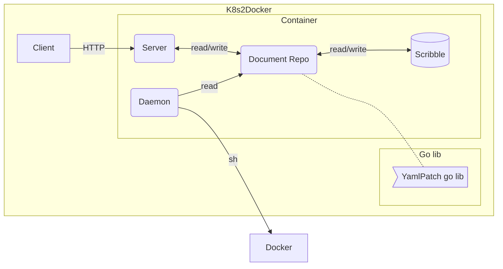

# K8s2Docker

## Principle

```mermaid
flowchart LR

    Patcher>YamlPatch go lib]
    Repo(Document Repo)
    Db[(Scribble)]
    Daemon(Daemon)
    Cli[Client]
    Server(Server)
    Docker[Docker]
    

    subgraph K8s2Docker
        direction TB
        Cli

    
        subgraph Go lib
            Patcher
        end

        subgraph Container
            Server
            Repo
            Db
            Daemon
        end
    end

    Repo -.- Patcher
    Cli -->|HTTP| Server
    Server <-->|read/write| Repo
    Daemon -->|read| Repo
    Daemon -->|sh| Docker
    Repo <-->|read/write| Db
  
```
